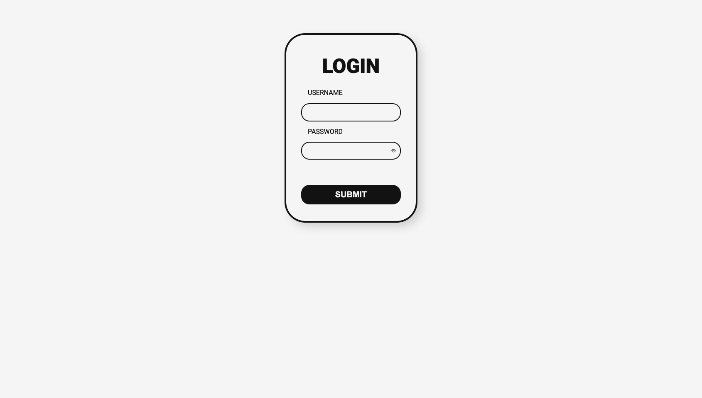
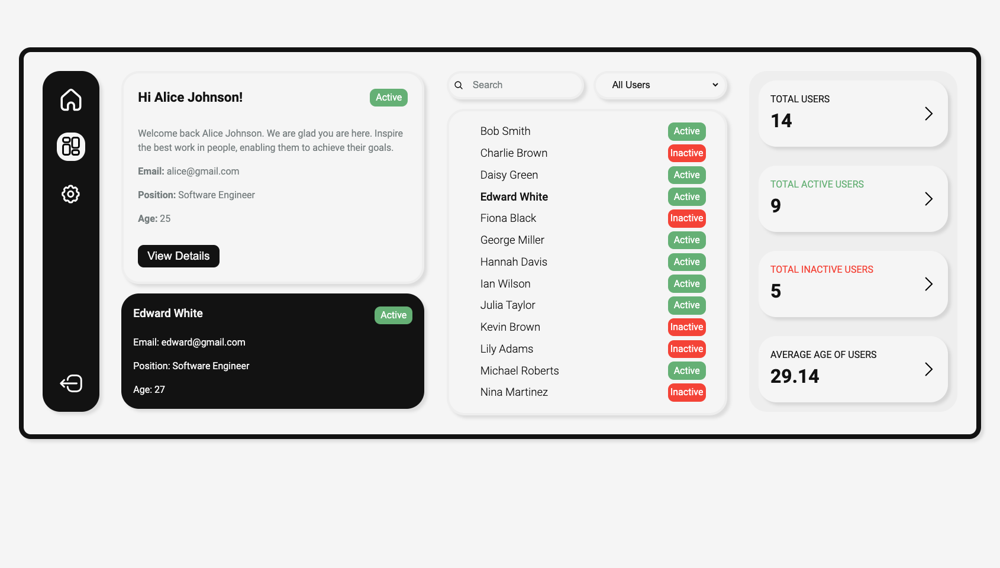

# Login Dashboard Page

This is a simple dashboard page with user authentication, a user directory, and the ability to filter and search users. The app is built using **React**, **TypeScript**, and **Vite**, and includes features like secure login with `bcrypt` for password encryption, and a protected route for the dashboard page.  

## Features

- **Login Authentication**: Secure login system with password encryption using `bcrypt`.
- **User Directory**: A directory of mock users that can be searched and filtered by name and position.
- **Protected Routes**: Only logged-in users can access the dashboard.
- **Responsive Design**: The app is styled to be responsive across different devices.
- **Persistent Login**: User login state is stored in `localStorage`.

## Screenshots




## Live Demo

[Live Demo](https://chaithawat21.github.io/login-dashboard-page/)

**Login credentials** (from mock data):

- **Username**: alice
- **Password**: a123456
or
- **Username**: bob
- **Password**: b123456

## Installation

### Setup

1. Clone this repository:

   ```bash
   git clone https://github.com/chaithawat21/login-dashboard-page.git
2. Change directory

    cd login-dashboard-page
3. Install the dependencies:

    npm install  
4. Start the development server:

    npm run dev  

## Dependencies

React: A JavaScript library for building user interfaces.
TypeScript: Strongly typed programming language that builds on JavaScript.
Vite: A fast build tool and development server.
bcryptjs: A library to hash and check passwords for authentication.
React Router: For handling routing and protected routes.
